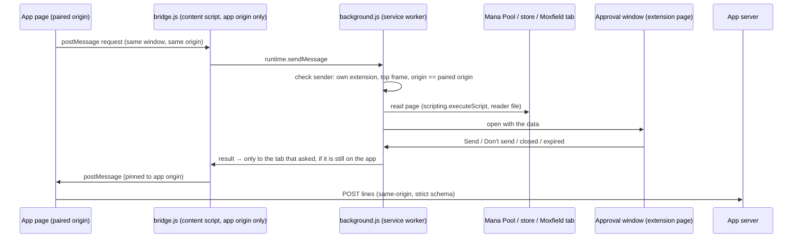

# Browser companion — threat model and security design

Status: built (beta, internal `companion` flag). Code: `extension/` (Manifest V3, plain JavaScript,
no dependencies, no build step), app side `web/src/core/companion.ts` + `web/src/app/useCompanion.ts`,
server side `src/magic_manager/api/companion.py` + `companion.py`. Decisions: architecture doc §25
H12/H13. Owner requirement (2026-10-07, verbatim): *"we should also be very aware of security
concerns users may have and develop in a way that we cannot be used by a malicious actor to harm
our users."*

## What it does, in one paragraph

The app asks the companion to read something only the user's own browser can see: their Mana Pool
cart page, their open store tabs, or a Moxfield deck. The companion reads it locally and opens **its
own approval window** that shows exactly what would be sent. Only when the user presses **Send**
does it hand those lines to the app tab that asked. The app then posts them to its own server, like
any other request. No credential, cookie, session token, email or address ever leaves the browser.
The server never sees a Mana Pool login.

## Assets

1. The user's marketplace accounts (Mana Pool, Moxfield, stores): passwords, session cookies/tokens,
   addresses, payment details, order history.
2. The user's collection data in the app (writes must come from the user).
3. The integrity of what the app believes is in a cart or deck.

## Attackers and how each is stopped

### 1. A malicious website that tries to talk to the extension or the app

| Attack | Defence | Pinned by |
|---|---|---|
| A page calls the extension directly | No `externally_connectable`: no web page can reach the worker. | `test_manifest_asks_for_the_least` |
| A page posts our message format | The bridge is registered only for the **paired origin**. It re-checks `location.origin` against the stored pairing and ignores everything else. On other sites (or another port on localhost) nothing answers and no window opens. | `companion-extension.spec.ts` (other site, other port) |
| A forged message reaches the worker | The worker checks `sender.id`, `sender.frameId === 0`, `sender.origin === paired origin` **and** the tab's current URL. Extension-page messages are accepted only from the extension's own origin. | same + code review |
| An iframe on the app page | The bridge runs top-frame only (`allFrames: false`, `window.top === window`), and the worker requires `frameId 0`. | code |
| Approval-window spam | One pending request at a time (`request.busy`), focus goes to the open window, 5-minute expiry, closing counts as no. | `companion-extension.spec.ts` (busy, close) |
| Clickjacking / keystroke-jacking the approval | The window is the extension's own page and can't be framed (no `web_accessible_resources`, CSP `frame-ancestors 'none'`). "Don't send" has focus and "Send" is disabled for the first second, like Chrome's permission prompts. | `companion-extension.spec.ts` (focus) |
| Cross-site writes to the app's API (CSRF) | **App-wide:** every non-GET `/api/` request whose browser `Sec-Fetch-Site` is not `same-origin`/`none` is refused with `request.cross_site`. That covers other sites and other localhost ports. JSON bodies need a CORS preflight the server never grants. | `test_writes_only_from_the_apps_own_pages` |
| Smuggling extra fields to the server | The companion endpoints use strict Pydantic models (`extra="forbid"`) with size caps. A body carrying `cookie`/`session`/unknown fields is a 422. | `test_cart_lines_route_audits_and_refuses_extras`, `test_cart_reader_output_is_exactly_what_the_server_accepts` |

### 2. A compromised or spoofed app server (or someone impersonating our app)

- **Pinned, user-confirmed origin.** The user types the app address on the extension's settings page
  and Chrome asks them to allow it. Nothing on a web page can set it. Allowed: `http://localhost`,
  `http://127.0.0.1`, or `https://*.ts.net` (Tailscale) in this build. Plain http is refused for
  anything but this computer. Addresses with a path or credentials are refused (`parseAppOrigin`,
  pinned by the extension e2e).
- **Data minimisation.** Even a malicious paired app can only receive what the readers produce, after
  the user approves it:
  - cart: card name, printing id (Scryfall id from the image link), set name, finish, condition,
    treatments, quantity and unit price. No seller, address, totals, account or Mana Pool ids.
  - tabs: URL and title of open tabs on the Deals stores. For open-tab stores also the page title,
    whitelisted price/stock meta tags, schema.org Product JSON-LD, and visible lines that mention a
    price or stock. The store-page fixture plants a name, an address and a CSRF token, and the test
    asserts none are read.
  - Moxfield: deck name, author user name, and per card: printing, quantity, finish and board.
    Profile, likes, prices and internal ids are dropped (pinned).
- **The user sees exactly what is sent**: a table plus the raw JSON, before anything leaves.
- **Read-only to every site.** No cart edits, purchases or writes, and no form submission.

### 3. Supply chain / extension update

- **Minimal permissions**: `scripting` + `storage` only. Install-time host access is
  `https://manapool.com/*` only: the cart page, **not** its `sb-api` host. Everything else is
  **optional** and asked for when the user switches a feature on:
  - the paired app address,
  - **Deals**: the 18 store sites from `config/vendors.toml` (generated into the manifest; CI fails
    when stale),
  - **Moxfield**: `moxfield.com` + subdomains.
  No `<all_urls>`, `tabs`, `cookies`, `webRequest`, `history`, `debugger`, `nativeMessaging`
  (all asserted absent).
- **No remote code**: no `eval`/`new Function`/`importScripts`/`innerHTML`, no remote URLs beyond the
  three sites, and a strict extension-page CSP (`script-src 'self'; object-src 'none'; base-uri 'none'`).
  The test scans every file.
- **No dependencies, no build step.** The source in `extension/` *is* the extension. The zip the app
  serves is **byte-for-byte reproducible** (sorted entries, fixed timestamps), so a download can be
  compared to the repo (`test_zip_is_reproducible_and_ships_only_the_extension`).
- **No auto-update channel.** Beta installs are unpacked. Updating is a deliberate re-download (the
  app shows "update available" by comparing versions). Store distribution is a later decision.

### 4. Data misuse / overreach

- Reads happen **only** when the app asks and the user then presses Send. There's no background
  collection or polling. The **extension** sends no analytics. The **app** reports only a failure's
  catalogued code as `companion.error {code}` (`config/analytics_events.toml`, the enum is exactly
  `extension/errors.json`), under the user's analytics consent. Never any cart, tab or deck content.
- Storage: the paired origin (`storage.local`), plus the one pending request in `storage.session`
  (memory only, not readable by content scripts, cleared on decision).
- Tabs the companion opens itself (a cart or deck tab, in the background) are closed afterwards.
  Your own open tabs are left alone.

### 5. The bookmarklet fallback

It runs in the user's Mana Pool page, so the same rules apply. It is **the extension's cart reader
verbatim** plus a few lines that copy the result to the clipboard
(`test_bookmarklet_is_the_extension_reader_verbatim`). It makes no network call and reads no cookies
or storage. The user pastes it into the app themselves. The app validates the paste with the same
schema (`parseBookmarkletPaste`) and the server's strict model.

## Residual risks (accepted, documented)

- **A compromised machine or browser** defeats any extension. Out of scope.
- **XSS in the paired app** could trigger requests. Each still needs the user's Send in the
  extension's window, which names the asking origin and shows the data.
- **Store page text lines** are filtered to lines mentioning a price or stock, so a personal line that
  also contains a price (e.g. "Jared's cart: $0.00") could be included. It's shown in the approval
  window before sending.
- **DNS rebinding** against a localhost app (a hostile domain resolving to 127.0.0.1) isn't stopped by
  `Sec-Fetch-Site`. Mitigation belongs with hosted auth (Phase 3, H4: a Host allowlist plus session
  cookies). The companion itself is unaffected, because it pairs by exact origin.
- **Moxfield private decks** are read through the user's own signed-in browser session. The browser
  attaches its own cookies to the one deck request, and the companion never reads them.

## Security review (2026-10-07)

The security-review agent reviewed the finished diff: **no exploitable findings.** Message authentication,
the approval window, pairing, readers, strict endpoints, the write guard, the bookmarklet and the
web protocol client were all assessed as sound. One pre-existing, below-threshold note was deferred
to hosting/auth (H4) by the owner: no Host-header allowlist, so DNS rebinding against a localhost
API isn't blocked (see Residual risks). The pinned tests then caught and fixed two real bugs before
merge:
- The approval window is itself a tab, so its decision was mis-routed as an app request and read as
  "expired". The worker now routes the extension's own pages first.
- "Don't send" could be clicked before its handler loaded. Both buttons now start disabled.
